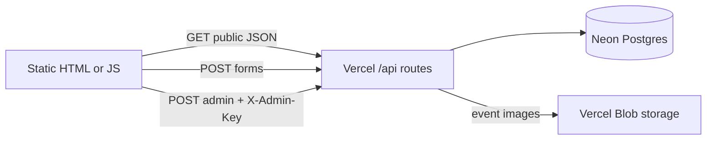

# Firebase to Vercel + Neon — Migration Reference

This document is split into **sections** you can jump to while completing the work. The public UI is unchanged; only backend wiring and small dashboard scripts differ.

---

## Section A — Goals and constraints

- **End users** see the same pages, layout, and flows as before.
- **Firebase is removed** from the codebase. Data and file uploads go through **Vercel Serverless Functions** + **Neon Postgres** (+ **Vercel Blob** for event images).
- **Realtime listeners** (Firebase `.on('value')`) are replaced by **HTTP `fetch` on page load** (same content after refresh; no live push).

---

## Section B — Architecture

| Old (Firebase) | New |
|----------------|-----|
| Realtime DB `upcomingEvents` | Table `upcoming_events` |
| Realtime DB `pastEvents` | Table `past_events` |
| Realtime DB `registration` | Table `registrations` |
| Realtime DB `contact-form` | Table `contact_messages` |
| Cloud Storage `event_images/` | Vercel Blob `event_images/...` |

---

## Section C — Repository layout (new / changed)

| Path | Role |
|------|------|
| `api/**/*.js` | Vercel serverless handlers |
| `api/lib/db.js` | Neon client factory |
| `package.json` | Dependencies: `@neondatabase/serverless`, `@vercel/blob` |
| `vercel.json` | Vercel project config |
| [`doc/sql/schema.sql`](sql/schema.sql) | Run once in Neon SQL Editor |
| `js/api-config.js` | **You edit:** optional API base URL + admin secret (see Section G) |
| `js/msm-api.js` | Shared `fetch` helpers for the site |

---

## Section D — API routes (contract)

All responses set CORS `*` for browser calls from static hosting (or same-origin on Vercel).

### Public (no secret)

| Method | Path | Body | Response |
|--------|------|------|----------|
| GET | `/api/events/upcoming` | — | JSON object keyed by `id`, values `{ image, title, time, description, link }` (Firebase-shaped) |
| GET | `/api/events/past` | — | Same shape for past events |
| POST | `/api/contact` | JSON `{ name, email, phone?, msg }` | `{ ok: true }` |
| POST | `/api/registration` | JSON `{ name, email, phone, event }` | `{ ok: true }` |

### Admin (header `X-Admin-Key: <ADMIN_API_KEY>`)

| Method | Path | Body | Response |
|--------|------|------|----------|
| POST | `/api/admin/events` | JSON `{ image, fileName, title, time, description, link }` where `image` is a **data URL** (base64) | `{ ok: true, id }` |
| POST | `/api/admin/move-event` | JSON `{ id }` (upcoming row UUID) | `{ ok: true }` |
| DELETE | `/api/admin/past-event?id=<uuid>` | — | `{ ok: true }` |

---

## Section E — Environment variables (Vercel)

Set these in **Vercel → Project → Settings → Environment Variables**:

| Variable | Required | Purpose |
|----------|----------|---------|
| `DATABASE_URL` | Yes | Neon connection string (pooled recommended) |
| `ADMIN_API_KEY` | Yes | Long random string; must match `MSM_ADMIN_KEY` in `js/api-config.js` |
| `BLOB_READ_WRITE_TOKEN` | Yes for dashboard uploads | From Vercel → Storage → Blob |

Optional:

| Variable | Purpose |
|----------|---------|
| `MSM_API_BASE` | Not used on server; client uses `js/api-config.js` instead |

---

## Section F — Neon setup

1. Create a database at [neon.tech](https://neon.tech).
2. Open **SQL Editor**, paste and run [`doc/sql/schema.sql`](sql/schema.sql).
3. Copy the **connection string** (use the **pooled** string if offered) into Vercel as `DATABASE_URL`.

---

## Section G — Client config (`js/api-config.js`)

1. **`MSM_API_BASE`**
   - If the site is deployed **on the same Vercel project** as the API: leave `''` (empty). Requests use relative `/api/...`.
   - If the site is hosted **elsewhere** (e.g. static host): set to your Vercel deployment origin, e.g. `https://your-app.vercel.app` (no trailing slash).

2. **`MSM_ADMIN_KEY`**
   - Must equal Vercel `ADMIN_API_KEY`.
   - **Security note:** This is visible in the browser (same weakness as the old open Firebase dashboard). For stronger security later, add proper auth (e.g. Vercel Password Protection or session login).

---

## Section H — Deploy checklist

- [ ] Run `schema.sql` on Neon
- [ ] Create Vercel project from this repo root
- [ ] Enable **Blob** on Vercel; add `BLOB_READ_WRITE_TOKEN`
- [ ] Set `DATABASE_URL`, `ADMIN_API_KEY`
- [ ] Edit `js/api-config.js` (`MSM_ADMIN_KEY`, optional `MSM_API_BASE`)
- [ ] Deploy; test: upcoming events page, past events, registration, contact, dashboard flows

---

## Section I — Firebase removal / leftovers

- Firebase SDK script tags removed from affected HTML and from `registration.html`.
- `firebase.json` is **legacy** for Firebase Hosting; primary hosting is **Vercel**. You may delete `firebase.json` later or keep for reference.
- Hardcoded **Firebase Storage** image URLs on `index.html` (hero carousel) are unchanged URLs; replace those image `src` values when you host new assets (optional, not required for API functionality).

---

## Section L — Contact form and EmailJS

The home page contact form previously called `sendMail()` (EmailJS) on the button. It now submits only to **`POST /api/contact`** (Neon). The file `Escript.js` in the site root is unchanged on disk but is **no longer wired** from the home page; if you want both database storage and an email copy, add a call to `sendMail()` inside `mail.js` after a successful `fetch`, or re-enable the button `onclick` (you would then need `preventDefault` + both paths).

---

## Section J — Rollback / troubleshooting

| Symptom | Check |
|---------|--------|
| 401 on dashboard actions | `X-Admin-Key` / `MSM_ADMIN_KEY` / `ADMIN_API_KEY` alignment |
| 500 on create event | `BLOB_READ_WRITE_TOKEN`, image size (keep under Vercel body limits) |
| Empty event lists | Neon tables empty; run SQL schema; add a test row or use dashboard |
| CORS errors | API must be called with correct `MSM_API_BASE`; or deploy site on same Vercel project |

---

## Section K — Completion log (fill in as you go)

| Step | Done | Date / notes |
|------|------|----------------|
| Neon schema applied | ☐ | |
| Vercel env vars set | ☐ | |
| Blob token set | ☐ | |
| `api-config.js` updated | ☐ | |
| Production smoke test | ☐ | |
